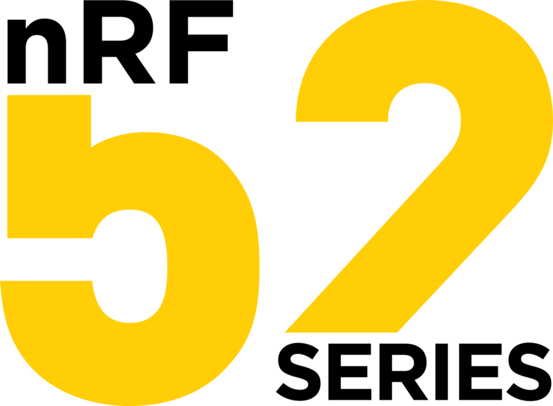
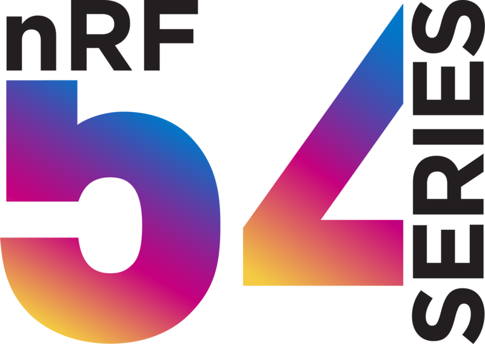
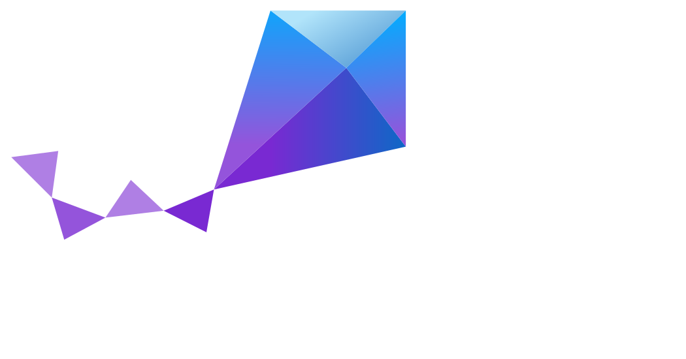
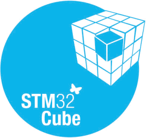
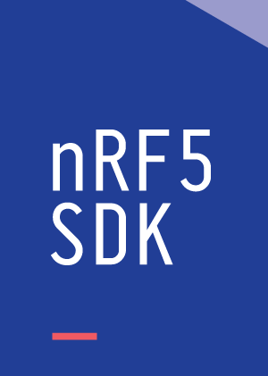
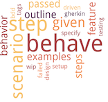
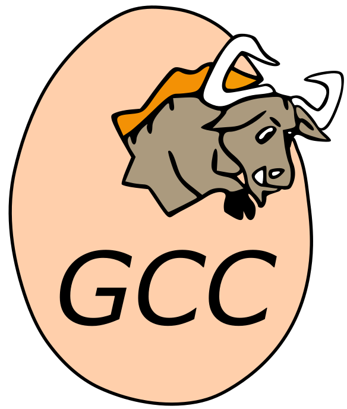
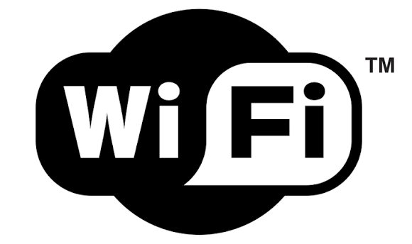
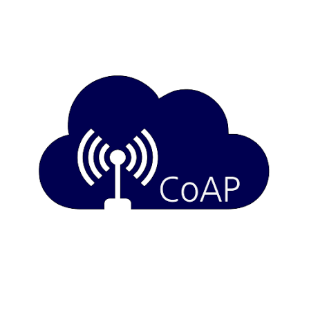

<!--

# Header 1

## default

-->

<!--

## dark

## radical

## merko

## gruvbox

## gruvbox_light

## tokyonight

## onedark

## cobalt

# Header 2

## default

## dark

## radical

## merko

## gruvbox

## gruvbox_light

## tokyonight

## onedark

## cobalt

-->

  
  

<!--
## Hi there 👋

**mlokcewicz/mlokcewicz** is a ✨ _special_ ✨ repository because its `README.md` (this file) appears on your GitHub profile.

Here are some ideas to get you started:
-->

---

### 🧑‍💻 About me

Embedded systems, electronics, 8-bit computers, and punk rock music enthusiast.

#### 💻 Languages

  
  
  
  
  
  

#### ⚙️ MCUs & Architectures

  
  
  
  
  
  

#### 🧠 RTOS, SDKs & Firmware

  
  
  
  
  
  
  
  

#### 🔧 Debugging & Development

  
  
  

#### 🧪 Testing & Validation

  
  
  
  

#### 🏗️ Build, Version Control & CI

  
  
  
  
  
  
  
  

#### 📡 Connectivity & Protocols

  
  
  
  
  
  

---

### 📦 Public Repositories

  
  
  
  
  
  
  
  

